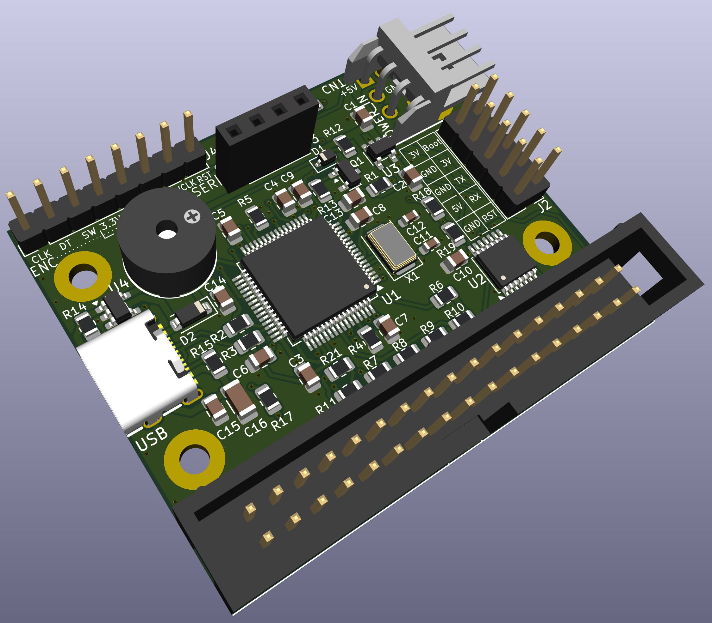

# Nano-Tek

A tiny, modern reimagining of the classic **Gotek** floppy-disk-drive emulator. Nano-Tek keeps the full feature set of a Gotek-style FDD emulator but packs it onto a board that is a fraction of the size, hence the name *Nano*-Tek.

<p align="center">
  
</p>

The schematic is derived from the open-source [**OpenFlops**](https://github.com/SukkoPera/OpenFlops) design by *SukkoPera*, re-laid-out on a compact 4-layer PCB.

## Highlights

- **A lot smaller.** The board measures just **51 × 42 mm**, roughly half the footprint of a standard Gotek, while keeping the same 34-pin floppy interface.
- **FlashFloppy-compatible.** Built around the **STM32F105RBT6** (Cortex-M3) MCU, so it runs the popular [FlashFloppy](https://github.com/keirf/flashfloppy) firmware.
- **USB-C.** A modern USB-C port for the USB stick, fed through a current-limited power switch. It can also power the board on the bench.
- **OLED + rotary encoder** headers for a clean front-panel UI.
- **On-board passive buzzer** for the drive-step "click" and FlashFloppy's notification beeps.
- **Easy first flash.** Serial (with a BOOT0 jumper) and SWD headers on board, so a blank chip can be programmed without extra wiring.
- **4-layer PCB** for clean power and signal routing in a small area.

## Hardware overview

| Function          | Part / Connector                         | Ref     |
|-------------------|------------------------------------------|---------|
| Microcontroller   | STM32F105RBT6 (LQFP-64)                  | U1      |
| Bus buffer        | 74LCX07 (TSSOP-14)                       | U2      |
| 3.3 V regulator   | AP2112K-3.3 (SOT-23-5)                   | U3      |
| USB power switch  | SY6288DAAC, current-limited (SOT-23-5)   | U4      |
| USB bench power   | B5819W Schottky diode (USB-C to +5 V)    | D2      |
| Clock             | 8 MHz crystal                            | X1      |
| Floppy interface  | 34-pin IDC header                        | CN3     |
| Power input       | 4-pin power connector (171826-4)         | CN1     |
| USB               | USB-C (SMD)                              | CN2     |
| Display           | OLED header (I²C)                        | J3      |
| Input + debug     | Rotary encoder + SWD header (1×8)        | J4      |
| Programming       | Serial + BOOT0 header (2×5)              | J2      |
| Audio             | Passive buzzer, 9 mm (QMB-09B-05)        | J1      |

See [`Nano-Tek.pdf`](Nano-Tek.pdf) for the full schematic and [`jlcpcb/production_files/BOM-Nano-Tek.csv`](jlcpcb/production_files/BOM-Nano-Tek.csv) for the complete bill of materials.

## Repository layout

```
Nano-Tek.kicad_pro      KiCad 10 project
Nano-Tek.kicad_sch      Schematic
Nano-Tek.kicad_pcb      PCB layout (4-layer)
Nano-Tek.pretty/        Project-specific footprint library
3dmodels/               3D models for connectors/parts
docs/                   Builder's guide, ST-LINK/V2 label
docs/images/            Rendered board images
jlcpcb/                 Gerbers, BOM and CPL for JLCPCB assembly
Nano-Tek.pdf            Schematic export
```

## Manufacturing

Ready-to-order production files for **JLCPCB** (4-layer) are provided in
[`jlcpcb/production_files/`](jlcpcb/production_files/):

- `GERBER-Nano-Tek.zip`: Gerber + drill files
- `BOM-Nano-Tek.csv`: bill of materials (with LCSC part numbers)
- `CPL-Nano-Tek.csv`: component placement / pick-and-place

## Firmware

A new board needs its first [FlashFloppy](https://github.com/keirf/flashfloppy) flash over **serial** (J2, BOOT0 jumper on pins 9–10) or **SWD** (J4, ST-Link). USB-C (DFU) does not work on a blank chip; it is only for recovery once FlashFloppy is on the board. Download the release zip from the [FlashFloppy releases page](https://github.com/keirf/flashfloppy/releases) and use `hex/flashfloppy-at415-st105-<ver>.hex` from it.

Step-by-step wiring for USB-serial adapters, PL2303 cables, ST-Link clones and the official ST-LINK/V2 is in the [builder's guide](docs/Nano-Tek_First_Firmware_Flash_Builders_Guide.pdf). After the first flash, update from a USB stick: copy the `.upd` file to the stick and hold the encoder button at power-on.

> **Note:** The USB-C port is a host port. Use a USB-A to USB-C data cable to power the board from a PC; USB-C to USB-C cables don't power it.

## Revisions

- **Rev 1.3** (October 2026): on-board passive buzzer, USB power switch, J2 serial pins now match the silkscreen, PA9/PA10/PA3 pull-ups, /MOTOR on PA15, NRST on J4 pin 8.
- **Rev 1.0–1.2:** J2 TX/RX are swapped against the silkscreen, and D1 must be fitted across the speaker (not in series) for sound. The builder's guide marks the steps that differ.

## Credits & license

- Schematic derived from [OpenFlops](https://github.com/SukkoPera/OpenFlops) by **SukkoPera**.
- Firmware: [FlashFloppy](https://github.com/keirf/flashfloppy) by **Keir Fraser**.
- Thanks to Vinny, Mesarim, Screemo, Kavanoz, Wrangler and Ordyne.

Please check the upstream OpenFlops project for its licensing terms; this derivative is shared in the same open-hardware spirit.

---

*Nano-Tek: the Gotek, shrunk.* Rev 1.3.
